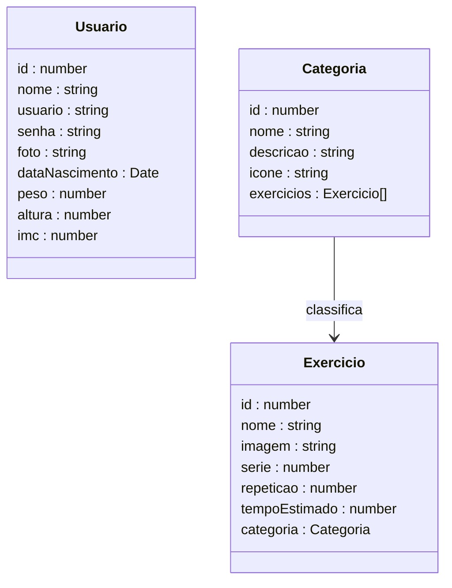

# Solara Fitness - Frontend

<p align="center">
  <a href="https://solara-frontend-fitness.vercel.app/" target="blank"></a>
</p>

<div align="center">
  
  
  
  
  
  
</div>

---

## 1. Descrição

Interface web da plataforma **Solara Fitness**, desenvolvida para iluminar hábitos diários e transformar a disciplina dos treinos em uma jornada de saúde guiada e organizada. O frontend consome a API REST do projeto backend e permite que os usuários cadastrem exercícios, organizem categorias musculares, gerenciem seu perfil e acompanhem suas métricas corporais de forma prática e fluida.

🔗 **Deploy:** [solara-frontend-fitness.vercel.app](https://solara-frontend-fitness.vercel.app/)

---

## 2. Funcionalidades

1. **Autenticação de usuários** — cadastro e login com senha criptografada
2. **Gerenciamento de perfil** — visualização e edição de dados pessoais
3. **Métricas corporais** — exibição de peso, altura e cálculo automático de IMC realizado pelo backend
4. **Listagem de exercícios** — visualização dos exercícios cadastrados com busca por nome
5. **Cadastro e edição de exercício** — formulário para criar e atualizar exercícios com imagem, categoria, séries, repetições e tempo
6. **Listagem de categorias** — visualização das categorias musculares com contagem de exercícios vinculados
7. **Cadastro e edição de categoria** — registro e atualização de categorias com descrição e ícone

---

## 3. Capturas de Tela

<div align="center">

<table>
  <tr>
    <td align="center" colspan="2"><b>Home</b></td>
  </tr>
  <tr>
    <td align="center" colspan="2"></td>
  </tr>
  <tr>
    <td align="center"><b>Login</b></td>
    <td align="center"><b>Cadastro</b></td>
  </tr>
  <tr>
    <td></td>
    <td></td>
  </tr>
  <tr>
    <td align="center"><b>Perfil</b></td>
    <td align="center"><b>Editar Perfil</b></td>
  </tr>
  <tr>
    <td></td>
    <td></td>
  </tr>
  <tr>
    <td align="center"><b>Exercícios</b></td>
    <td align="center"><b>Editar Exercício</b></td>
  </tr>
  <tr>
    <td></td>
    <td></td>
  </tr>
  <tr>
    <td align="center"><b>Categorias</b></td>
    <td align="center"><b>Cadastrar Categoria</b></td>
  </tr>
  <tr>
    <td></td>
    <td></td>
  </tr>
</table>

</div>

---

## 4. Diagrama de Classes (Models)

O diagrama abaixo representa as interfaces TypeScript utilizadas no frontend e seus relacionamentos.



---

## 5. Rotas da Aplicação

| Caminho | Página | Descrição |
|---------|--------|-----------|
| `/` | Home | Página inicial da plataforma |
| `/sobre` | Sobre | Informações sobre a equipe |
| `/projeto` | O Projeto | Contexto e problema que a Solara resolve |
| `/login` | Login | Autenticação de usuário |
| `/cadastro` | Cadastro | Criação de nova conta |
| `/perfil` | Perfil | Visualização de dados e métricas corporais |
| `/perfil/editar` | Editar Perfil | Edição de dados pessoais |
| `/exercicios` | Listagem de Exercícios | Lista todos os exercícios com busca por nome |
| `/exercicios/cadastrar` | Cadastrar Exercício | Formulário de novo exercício |
| `/exercicios/editar/:id` | Editar Exercício | Formulário de edição de exercício existente |
| `/categorias` | Listagem de Categorias | Lista todas as categorias cadastradas |
| `/cadastrarcategoria` | Cadastrar Categoria | Formulário de nova categoria |
| `/editarcategoria/:id` | Editar Categoria | Formulário de edição de categoria existente |

---

## 6. Tecnologias

| Item | Descrição |
|------|-----------|
| **Linguagem** | TypeScript |
| **Biblioteca** | React JS |
| **Build** | Vite |
| **Estilização** | Tailwind CSS v4 |
| **Roteamento** | React Router DOM |
| **Requisições HTTP** | Axios |
| **Notificações** | React Toastify |
| **Deploy** | Vercel |

---

## 7. Arquitetura do Projeto

O projeto segue uma organização modular por responsabilidade, aplicando boas práticas de projetos React modernos:

- **Pages** → telas da aplicação, compostas por componentes
- **Components** → elementos reutilizáveis de interface (Navbar, Footer, Cards, Formulários)
- **Services** → camada de comunicação com a API via Axios
- **Models** → interfaces TypeScript que espelham as entidades do backend
- **Context** → gerenciamento de estado global de autenticação

Essa separação facilita a manutenção, escalabilidade e reaproveitamento de código.

---

## 8. Estrutura de Pastas

```plaintext
src/
│
├── components/         # Componentes reutilizáveis
│   ├── navbar/
│   ├── footer/
│   ├── categoria/
│   └── exercicios/
├── context/            # Contexto de autenticação do usuário
├── models/             # Interfaces TypeScript da aplicação
├── pages/              # Páginas estáticas e de usuário
│   ├── home/
│   ├── login/
│   ├── cadastro/
│   ├── perfil/
│   ├── Sobre.tsx
│   └── Projeto.tsx
├── services/           # Integração com a API (requisições HTTP)
├── util/               # Funções utilitárias e helpers
└── App.tsx             # Componente principal e configuração de rotas
```

---

## 9. Integração com o Backend

Este frontend consome a API REST do projeto backend, que expõe os seguintes recursos principais:

| Recurso | Descrição |
|---------|-----------|
| `POST /usuarios/cadastrar` | Cadastro de usuários |
| `POST /usuarios/logar` | Autenticação de usuários |
| `PUT /usuarios` | Atualização de dados do usuário |
| `GET /exercicios` | Listagem de exercícios |
| `GET /exercicios/nome/:nome` | Busca de exercícios por nome |
| `GET /exercicios/:id` | Busca de exercício por ID |
| `POST /exercicios` | Criação de exercício |
| `PUT /exercicios` | Atualização de exercício |
| `DELETE /exercicios/:id` | Exclusão de exercício |
| `GET /categorias` | Listagem de categorias |
| `GET /categorias/:id` | Busca de categoria por ID |
| `POST /categorias` | Criação de categoria |
| `PUT /categorias` | Atualização de categoria |
| `DELETE /categorias/:id` | Exclusão de categoria |

🔗 [Repositório do Backend](https://github.com/grupo6-js13/solara_backend_fitness)  
📖 Documentação interativa da API disponível via **Swagger** no backend

---

## 10. Boas Práticas Aplicadas

- Organização modular por responsabilidade
- Tipagem forte com TypeScript e interfaces bem definidas
- Separação entre lógica de negócio (services) e apresentação (components/pages)
- Gerenciamento de estado global com Context API
- Proteção de rotas com redirecionamento para usuários não autenticados
- Feedback visual com notificações via React Toastify

---

## 11. Diferenciais Técnicos

✅ SPA desenvolvida com React JS e TypeScript  
✅ Integração completa com API REST NestJS  
✅ CRUD completo de Exercícios e Categorias  
✅ Autenticação de usuários com senha criptografada  
✅ Cálculo automático de IMC via backend  
✅ Métricas corporais exibidas no perfil do usuário  
✅ Estilização responsiva com Tailwind CSS v4  
✅ Organização modular escalável  
✅ Deploy em produção via Vercel  

---

## 12. Requisitos

Para executar o projeto localmente:

- Node.js 18+
- npm
- API NestJS em execução (ver backend)

---

## 13. Configuração e Execução

1. Clone este repositório:
   ```bash
   git clone https://github.com/grupo6-js13/solara_frontend_fitness
   cd solara_frontend_fitness
   ```

2. Instale as dependências:
   ```bash
   npm install
   ```

3. Configure a variável de ambiente com o endereço da API:
   ```env
   VITE_API_URL=http://localhost:4000
   ```

4. Execute o projeto:
   ```bash
   npm run dev
   ```

5. Acesse em: `http://localhost:5173`

> Para rodar com o backend local, clone e execute o [Repositório do Backend](https://github.com/grupo6-js13/solara_backend_fitness) seguindo as instruções do README correspondente.

---

## 14. Autores

**Orbyte — Onde ideias orbitam a tecnologia**

🔗 **GitHub:** https://github.com/grupo6-js13/  
🔗 **E-mail:** grupo6js13@gmail.com

Projeto desenvolvido para **aprendizado contínuo**, **demonstração técnica** e **portfólio profissional**.